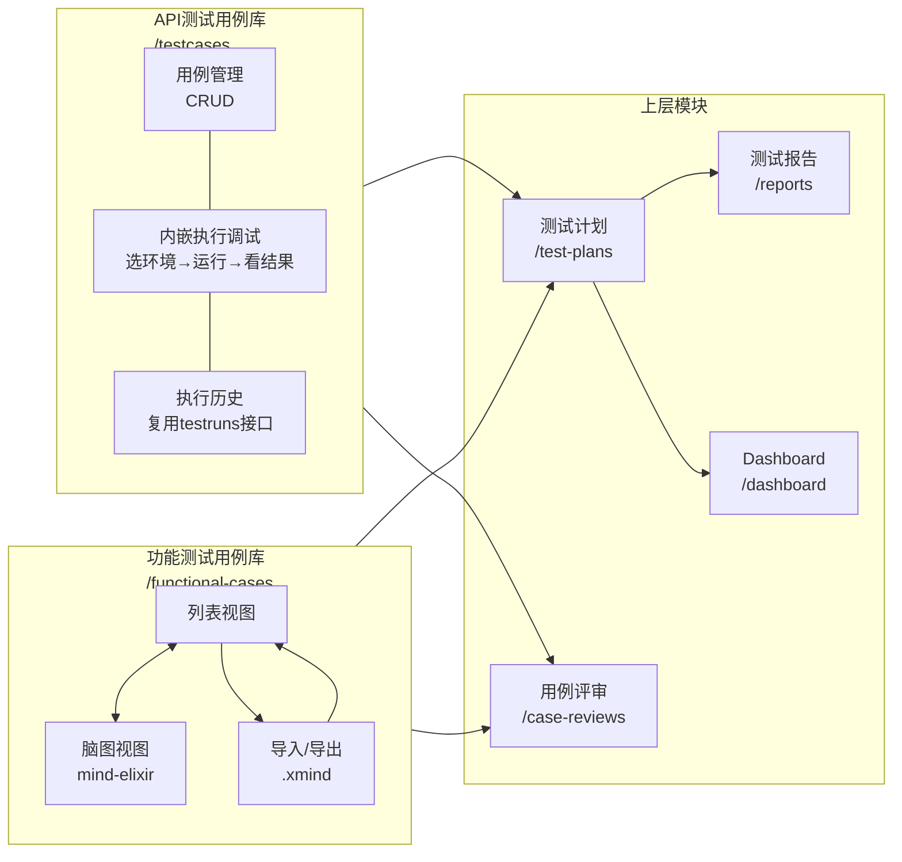

# 测试平台「双用例库」架构设计方案

## 背景与核心思路

当前平台已完整实现 API 自动化测试闭环：`api_test_cases` → `test_runs` → `test_results` → 报告。

用户目标：在此基础上新增**功能测试用例**（手动测试，类似 CODING 的用例管理），两套用例库通过统一的**测试计划**和**测试报告**层打通。




---

## 模块划分（改造后）

### 模块一：API 测试用例库（改造：合并执行调试）

**入口路由：** `/testcases`（现有，改造布局）

**核心改变：将原 `/testruns` 执行功能内嵌进来，实现「写用例 → 调试执行 → 看结果」在同一页面完成，类似 Postman/Apifox 体验。**

**页面三栏布局：**

```
┌─────────────┬────────────────────────┬──────────────────────────┐
│  左侧        │  中间                   │  右侧（点击用例展开）      │
│  模块树      │  用例列表               │  用例详情编辑面板          │
│  （现有）    │  （现有）               │  ┌──────────────────────┐ │
│             │                        │  │ 基本信息（方法/URL）   │ │
│             │  顶部操作栏：           │  │ Headers / Params     │ │
│             │  [批量执行] [新建用例]  │  │ Body / 断言规则       │ │
│             │                        │  ├──────────────────────┤ │
│             │                        │  │ [选择环境 ▼] [▶ 执行] │ │
│             │                        │  ├──────────────────────┤ │
│             │                        │  │ 执行结果              │ │
│             │                        │  │ Request / Response   │ │
│             │                        │  │ 断言明细              │ │
│             │                        │  ├──────────────────────┤ │
│             │                        │  │ 执行历史 Tab          │ │
│             │                        │  │ （该用例历次记录）     │ │
│             │                        │  └──────────────────────┘ │
└─────────────┴────────────────────────┴──────────────────────────┘
```

**保留的后端能力（无需改动）：**

- HTTP 方法、URL、Headers、Params、Body 编辑
- 断言规则（status_code / json_path / contains / regex / response_time）
- 环境变量 `{{VAR}}` 替换
- Celery 异步批量执行（`/testruns` 接口继续使用，不暴露为单独页面）
- 执行结果详情（request/response/断言明细）

**原 `/testruns` 独立页面：下线入口，数据保留**（历史执行记录仍可在报告页查看）

---

### 模块二：功能测试用例库（新增）

**入口路由：** `/functional-cases`（新增页面）

参考 CODING 测试管理设计，功能如下：

**用例结构字段：**

- 标题、所属分组（树形）、用例等级（P0/P1/P2/P3）
- 前置条件、测试步骤（多步骤，每步含操作+预期结果）
- 标签（多个）、预估工时、状态（草稿/待评审/已批准/已废弃）
- 创建人、创建时间

**核心功能：**

- 分组管理（树形，支持多级分组）
- 用例 CRUD（侧边抽屉编辑）
- 多维筛选（等级、标签、状态、分组）
- 批量操作（移动分组、批量删除、批量修改等级）
- **列表 / 脑图 双视图切换**（两者同步同一份数据）
- **.xmind 文件导入 / 导出**

---

#### 2.1 脑图视图（Mind Map View）

参考 CODING「测试协同 → 测试用例 → 脑图」功能，在功能测试用例库页面顶部提供「列表」/「脑图」Tab 切换。

**脑图节点类型（与数据库映射）：**


| 节点类型 | 显示标签       | 对应数据                  |
| ---- | ---------- | --------------------- |
| 根节点  | 根目录        | 当前分组根                 |
| 分组节点 | 目录（蓝色标签）   | `func_case_groups` 记录 |
| 用例节点 | 用例（黄色标签）   | `func_test_cases` 记录  |
| 前置条件 | 前置条件（灰色标签） | 用例 `precondition` 字段  |


**脑图操作工具栏：**

- 展开控制：展开到 1~6 级 / 全部展开
- 全选 / 反选 / 选择同级节点 / 选择子树
- 插入分组（子节点变为分组节点）
- 插入用例（子节点变为用例节点）
- 编辑节点标题（双击或按工具栏编辑按钮）
- 删除节点（含子树）
- 设置优先级（选中用例节点后可点 P0/P1/P2/P3）
- 保存（将脑图树结构同步写入数据库）

**脑图与列表双向同步逻辑：**

```
脑图保存 → 后端 diff 对比现有树结构 → 增删改 groups/cases
列表新增/修改用例 → 脑图视图切换时重新加载树数据
```

**前端技术选型：** 使用 `mind-elixir`（轻量级 React 脑图库，无框架绑定，支持自定义节点渲染）

```
npm install mind-elixir
```

---

#### 2.2 .xmind 文件导入 / 导出

**XMind 文件格式说明：**

`.xmind` 文件本质是 ZIP 压缩包，解压后包含 `content.json`（新版）或 `content.xml`（旧版），记录思维导图树结构。节点有 `title`、`children` 字段，与我们的 `group / case` 树完全对应。

**导入流程：**

```
用户上传 .xmind 文件
    → 后端解压 ZIP → 读取 content.json
    → 递归遍历节点树
        → 叶子节点 → 创建 func_test_cases
        → 非叶子节点 → 创建 func_case_groups
    → 返回导入统计（新增分组数、用例数）
```

**导出流程：**

```
用户点击「导出 .xmind」
    → 后端查询项目完整用例树
    → 递归构建 content.json 结构
    → 打包为 ZIP → 返回文件流下载
```

**后端依赖：**

```
pip install xmindparser    # 解析 .xmind 文件（支持新旧格式）
```

导出直接用 Python 内置 `zipfile` + `json` 生成，无需额外依赖。

**新增 API 端点：**


| 方法   | 路径                                                            | 功能              |
| ---- | ------------------------------------------------------------- | --------------- |
| POST | `/api/v1/projects/{project_id}/functional-cases/import-xmind` | 上传 .xmind 文件导入  |
| GET  | `/api/v1/projects/{project_id}/functional-cases/export-xmind` | 导出为 .xmind 文件   |
| GET  | `/api/v1/projects/{project_id}/functional-cases/tree`         | 获取完整树结构（脑图视图专用） |
| PUT  | `/api/v1/projects/{project_id}/functional-cases/tree`         | 保存脑图树结构（批量同步）   |


---

**新增数据库表：**

```
func_test_cases（功能测试用例）
├── id, project_id, group_id (FK)
├── title, precondition, status, priority (P0~P3)
├── steps JSONB  -- [{step:"操作", expected:"预期结果"}]
├── tags TEXT[]
├── estimated_hours FLOAT
└── created_by, created_at, updated_at

func_case_groups（用例分组，树形）
├── id, project_id, parent_id (self-ref FK)
├── name, sort_order
└── created_at
```

---

### 模块三：用例评审（新增）

**入口路由：** `/case-reviews`（新增页面）

支持对**两种用例**发起评审：

- 创建评审：指定评审名称、评审人（多人）、截止日期、用例来源（API用例/功能用例/混合）
- 评审状态流转：`进行中` → `已完成` / `已过期`
- 评审人操作：对每条用例标记「通过/不通过/待修改」+ 填写意见
- 评审通过率统计

**新增数据库表：**

```
case_reviews（评审任务）
├── id, project_id, title, status, deadline
├── created_by, created_at

case_review_members（评审人）
├── review_id (FK), user_id (FK), status（待评/已评）

case_review_items（评审用例条目）
├── review_id (FK)
├── case_type  VARCHAR  -- 'api' | 'functional'
├── case_id    INTEGER  -- 对应各自用例表的 id
├── result     VARCHAR  -- approved/rejected/pending
└── comment    TEXT
```

---

### 模块四：测试计划（新增）

**入口路由：** `/test-plans`（新增页面）

测试计划是连接用例与执行的核心枢纽：

- 创建计划：名称、关联迭代/版本、时间范围、负责人
- 添加用例：可从 API 用例库和功能用例库分别选入
- 计划执行：
  - **API 用例**：一键触发自动化执行（复用现有 `testruns` 机制）
  - **功能用例**：手动逐条标记执行结果（通过/失败/阻塞/跳过）+ 关联缺陷
- 进度跟踪：实时显示执行进度（已执行/总用例/通过率）

**新增数据库表：**

```
test_plans（测试计划）
├── id, project_id, name, description
├── status  VARCHAR  -- draft/active/completed
├── start_date, end_date
├── created_by, created_at

test_plan_items（计划内用例）
├── id, plan_id (FK)
├── case_type  VARCHAR  -- 'api' | 'functional'
├── case_id    INTEGER
├── status     VARCHAR  -- pending/passed/failed/blocked/skipped
├── executed_by, executed_at
└── comment, defect_ids JSONB
```

---

### 模块五：测试报告（增强）

**入口路由：** `/reports`（现有路由增强）

在现有 API 执行报告基础上，增加：

- 按测试计划生成报告（含 API + 功能用例的混合统计）
- 报告内容：执行概况、用例分类统计、缺陷分布、质量评分
- 导出为 PDF（使用 `reportlab` 或 `weasyprint`）

---

### 模块六：测试概览 Dashboard（增强）

**入口路由：** `/dashboard`（现有路由增强）

现有页面为空壳，改造为数据大盘：

- 统计卡片：API用例总数、功能用例总数、本周执行次数、综合通过率
- 缺陷趋势图（折线）
- 近期测试计划进度列表
- 活跃度热力图

---

## 改造范围总结

### 后端改动


| 文件/目录                                                          | 改动类型 | 说明                                                                          |
| -------------------------------------------------------------- | ---- | --------------------------------------------------------------------------- |
| [backend/app/models/](backend/app/models/)                     | 新增   | `func_test_case.py`, `func_case_group.py`, `test_plan.py`, `case_review.py` |
| [backend/app/api/v1/](backend/app/api/v1/)                     | 新增   | `functional_cases.py`, `test_plans.py`, `case_reviews.py`                   |
| [backend/app/api/v1/reports.py](backend/app/api/v1/reports.py) | 增强   | 新增按计划生成报告的接口                                                                |
| [backend/app/main.py](backend/app/main.py)                     | 修改   | 注册新路由                                                                       |
| `backend/alembic/versions/`                                    | 新增   | 新建 migration 文件                                                             |


### 前端改动


| 文件/目录                                                                            | 改动类型 | 说明                                       |
| -------------------------------------------------------------------------------- | ---- | ---------------------------------------- |
| [frontend/src/pages/TestCases/index.tsx](frontend/src/pages/TestCases/index.tsx) | 改造   | 右侧新增执行调试面板（内嵌执行+历史），替代原 `/testruns` 页面功能 |
| [frontend/src/pages/TestRuns/index.tsx](frontend/src/pages/TestRuns/index.tsx)   | 下线   | 移除页面路由入口，数据通过报告页查阅                       |
| `frontend/src/pages/FunctionalCases/`                                            | 新增   | 功能测试用例库页面（列表+脑图+xmind导入导出）               |
| `frontend/src/pages/TestPlans/`                                                  | 新增   | 测试计划页面                                   |
| `frontend/src/pages/CaseReviews/`                                                | 新增   | 用例评审页面                                   |
| [frontend/src/pages/Dashboard/index.tsx](frontend/src/pages/Dashboard/index.tsx) | 改造   | 从空壳变为数据大盘                                |
| [frontend/src/pages/Reports/index.tsx](frontend/src/pages/Reports/index.tsx)     | 增强   | 支持按计划查看报告，保留历史执行记录入口                     |
| `frontend/src/services/`                                                         | 新增   | 各新模块 service 文件                          |
| `frontend/src/App.tsx` 或路由配置                                                     | 修改   | 注册新路由，移除 /testruns 路由                    |


---

## 建议实施顺序

1. **功能测试用例库**（最核心，其他模块依赖它）
2. **测试计划**（连接两套用例的枢纽）
3. **测试概览 Dashboard**（数据展示，依赖前两步的数据）
4. **测试报告增强**（按计划生成报告）
5. **用例评审**（相对独立，可最后做）

